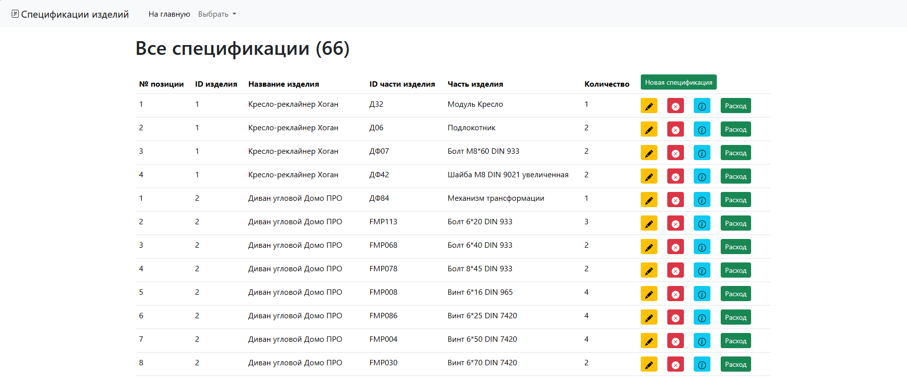
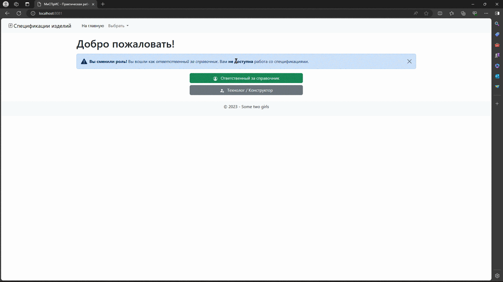
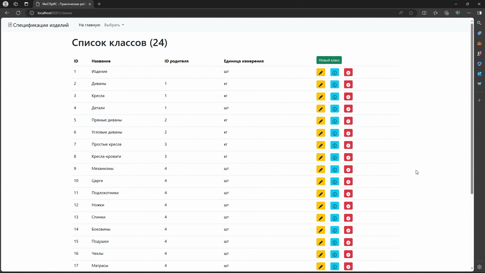
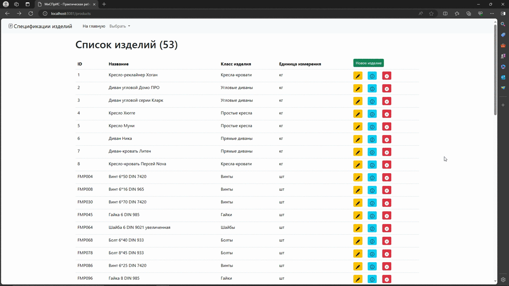
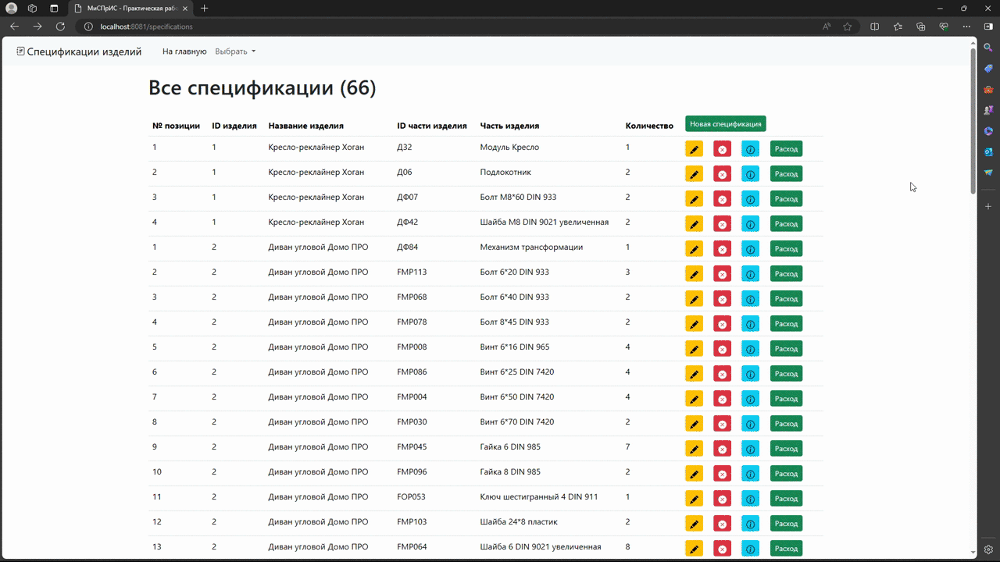

# Product Specifications
Курсовая работа по дисциплине "Методы и средства проектирования информационных систем". Представляет собой графический интерфейс для работы с базой данных спецификаций изделий.

## Используемый инструментарий
* PostgreSQL 15 и pgAdmin 4
* Node.js (v20.10.0) и npm (v10.2.3)
* Express (v4.18.2)
* EJS (v3.1.9)
* node-postgres (v8.11.3)
* Bootstrap (v5.3.2)

## Превью


---
*Начальная страница и списки*:



---
*Информация о классе изделий (в примере - Фурнитура)*:



---
*Информация об изделии (в примере - Диван-кровать Литен)*:



---
*Информация о спецификации и расчёт материальных расходв (в примере - для кресла Хюгге)*:



## Требования
1. Наличие `Node.js`, `npm` и `PostgreSQL`.
2. Предварительно созданная база данных с именем, указанным в файле `pool.js`. Например, с помощью pgAdmin создать пустую базу данных с именем из примера - `mispris`.
3. Необходимо, чтобы имя пользователя, имя хоста, имя базы данных, пароль и порт в PostgreSQL совпадали с заданными в файле `pool.js`.

## Установка проекта
### Установка
```
npm install
```
### Компиляция и запуск
```
npm start
```
Если всё удачно, то при первом запуске в консоли выведется 4 сообщения об успешности операций.

## Как использовать
* Изменить изначальное наполнение таблиц данными можно в функции `create` в файле `creation.js`.
* Из выпадающего списка `Выбор` можно выбрать интересующий список - классы изделий, изделия, единицы измерений и спецификации.
* Элементы в каждом списке можно добавлять, изменять и удалять.
* По синей кнопке `info` можно посмотреть доступную информацию о классах, изделиях и спецификациях.
* Столбец `Спецификация далее` позволяет перейти к спецификации части исходного изделия, если такая имеется.
* Кнопка `Расход` в разделе `Спецификации` перенаправляет к расчёту количества расходуемых материалов для заданного количества выбранного изделия.
